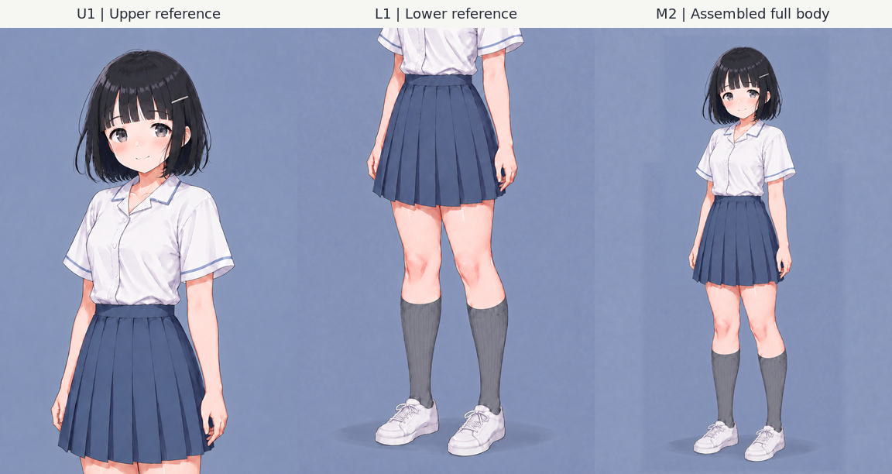

# Akari v3.1 — 上半身・下半身を分けた参照セット

今後の生成には、**U1上半身とL1下半身をそれぞれ原寸で渡す**。
顔・目・髪の原本はP1、普段の閉じ口の微笑みはP2。
合成全身M2は全体のバランス確認に使う。
S1のシルバー細ピンと、G2で選んだミディアムグレー靴下を引き継いでいる。



この一覧画像は閲覧用。生成時は下表の原寸画像を開いて渡す。

## 作業を再開する

まず [design-state.json](design-state.json) と
[reference-set.json](reference-set.json) を読む。
同じリポジトリ内の `akari-v3.0/` と一緒に使う。
JSON内の画像・記録パスは、`history/` 内のJSONも含めて
`akari-v3.1/` を基準とした相対パス。

| 参照 | 使う内容 | 位置付け |
| --- | --- | --- |
| [P1](../akari-v3.0/references/P1-user-pro-portrait.png) | 顔・目の設計・黒髪ボブ・描き方 | 原本の基準 |
| [P2](../akari-v3.0/references/P2-quiet-smile.png) | 普段の閉じ口の微笑み | 原本の基準 |
| [U1](references/U1-upper-reference.png) | 目元の描き込み・髪・上半身の制服 | 作業参照、1024×1536 |
| [L1](references/L1-lower-reference.png) | スカート・脚・グレー靴下・白スニーカー | 作業参照、1024×1536 |
| [S1](references/S1-silver-slim-pin.png) | 細ピンの形・色・位置 | ヘアアクセの基準 |
| [M2](references/M2-full-body-montage.png) | 頭身・全身のまとまり・上下のつながり | 合成した確認用全身、2048×3072 |
| [G2](references/G2-silver-pin-gray-socks-full-body.png) | 分割前の全身配置・選択した靴下色 | 保存した生成元 |
| [P6](../akari-v3.0/references/P6-relaxed-full-body.png) | 継承した体型・衣装構造 | 補助原本。旧紺色靴下は使わない |

U1・L1・M2の採用によって、P1/P2の顔と表情の基準は変わらない。
G2とM2に描かれた小さい顔を、新しい顔の原本にしない。

## 生成時の使い分け

生成前に、修正対象と必要な参照を `view_image` で開く。
各画像が何を指定するのか、プロンプトにも明記する。

| 作業 | 基本の入力 | 必要に応じて追加 |
| --- | --- | --- |
| 新しい全身・シチュエーション | P1＋P2＋原寸U1＋原寸L1 | ピン精度にはS1、全身比率にはM2 |
| 上半身・顔の描写 | P1＋P2＋原寸U1 | ピン精度にはS1 |
| 下半身の細部 | 原寸L1 | 元の配置・色にはG2、体型構造にはP6 |
| 既存画像の修正 | 修正対象を先頭にし、上記から必要な参照を追加 | 構図・ポーズ・カメラは修正対象を優先 |

全身を生成する場合も、U1とL1は個別の入力として渡す。
M2だけを渡したり、一覧画像やサムネイルで代用したりしない。
別の表情を指定された場合は、その指定を優先し、P2は普段の表情の比較基準にする。

新規全身生成の役割指定例（入力順：P1、P2、U1、L1）：

```text
画像1 P1：顔・目・黒髪ボブ・描き方の原本。
画像2 P2：普段の閉じ口の微笑み。P1の開いた口はコピーしない。
画像3 U1：目元の描き込み、髪とシルバー細ピン、上半身の制服。
画像4 L1：スカート、健康的な脚の輪郭、グレー靴下、白スニーカー。
顔の設計はP1、上半身の細部はU1、下半身の細部はL1に従う。
構図・ポーズ・背景は今回の場面指定に合わせる。

目はP1の丸みのある穏やかなたれ目を保つ。
小さな濃い楕円の瞳孔を、上側の濃いグレーと下側の明るいグレーから分離し、
虹彩下側の丸い淡色反射を残す。目の大きさや白い反射だけを増やさない。
細ピンは明るいシルバーの細い直線形を1本、本人の左側・耳の少し上。
靴下はミディアムグレー、不透明なリブ編み、膝下丈。
```

S1を追加した場合はピンだけ、M2を追加した場合は全体の比率だけを指定する。
承認画像ではピンは画面右側に見える。P6の紺色靴下やピンのない状態は
v3.1では引き継がない。

## 上下を生成してから合成する場合

1. 同じ全身配置から、頭全体を含む上半身と、両靴まで含む下半身の枠を作る。
   両方に腰・スカートを広く含め、カメラ、ポーズ、比率、照明を揃える。
2. 上半身にはP1/P2と必要なS1を渡し、顔が大きく描ける画角で目元を仕上げる。
   下半身にはL1を渡し、脚・靴下・靴を仕上げる。
   今回のU1/L1生成時は、G2から作った各ガイド画像を配置の基準にした。
3. 元の全身配置に沿って配置し、拡縮は縦横比を維持する。
   腕と手は片方の画像から一続きで残し、服や背景の内側でつなぐ。
   輪郭を無理に変形させず、つながらなければ使う領域を広げるか再生成する。
4. 全身に加えて、顔・腰・両手・スカート・両靴を拡大確認する。
   合成ができても、次回用にU1/L1相当の原寸画像を別々に保存する。

M2ではG2を背景に、L1、U1の順で配置した。
中央の腰帯からスカート側へ接合位置を下げることで、両腕・両手をU1から残している。
顔の再生成や幾何変形は行っていない。
生成された上下にはスカートのしわ・陰影の小さな差がある。
確認済みなのはこの立ち姿で、別ポーズには新しい配置と接合確認が必要。

引き絵を小さく表示すると、目に使える表示ピクセルは減る。
この運用では、原寸U1を別に残して生成へ直接渡すことで目の細部を参照しやすくする。

## 保存済みM2の合成を再現する

Python 3とImageMagickの `magick` が必要。
リポジトリのルートで、出力先に新しいディレクトリを指定して実行する。
選択済みのPNGは上書きしない。

```bash
python3 akari-v3.1/history/split-references/assemble.py \
  --output-dir build/akari-v3.1/montage-rebuild
```

[配置と入力ハッシュ](history/split-references/layout.json) および
[合成スクリプト](history/split-references/assemble.py) は、このM2を再現するためのもの。
別ポーズへ同じ接合位置をそのまま流用しない。
[合成記録](history/split-references/M2-assembly.json) に元画像と手順を保存している。

## 選択と来歴

[selection.json](selection.json) にS1・G2の選択と、U1/L1/M2の採用を記録した。

- [細ピンの生成記録](history/S1-generation.json)：青い細ピンAからS1への色変更
- [分割元全身の生成記録](history/G2-generation.json)：P6への細ピン追加とG2への靴下色変更
- [上下の生成記録](history/split-references/generation.json)：各入力の役割・プロンプト全文・生成ID・所要時間
- [画像一覧とSHA-256](asset-inventory.json)
- [検証記録](validation.json)

U1とL1は内蔵image_genの生成出力を加工せず保存した。M2はその合成画像。
生成モデル名はツール応答に公開されていないため、不明として記録している。
ガイド画像と必要な入力・プロンプトは、v3.0/v3.1のパッケージ内に保存してある。
S1の生成記録に残る `build/` のパスは探索時の履歴で、現在の生成には不要。
