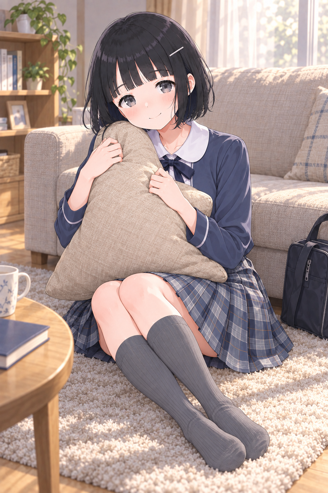
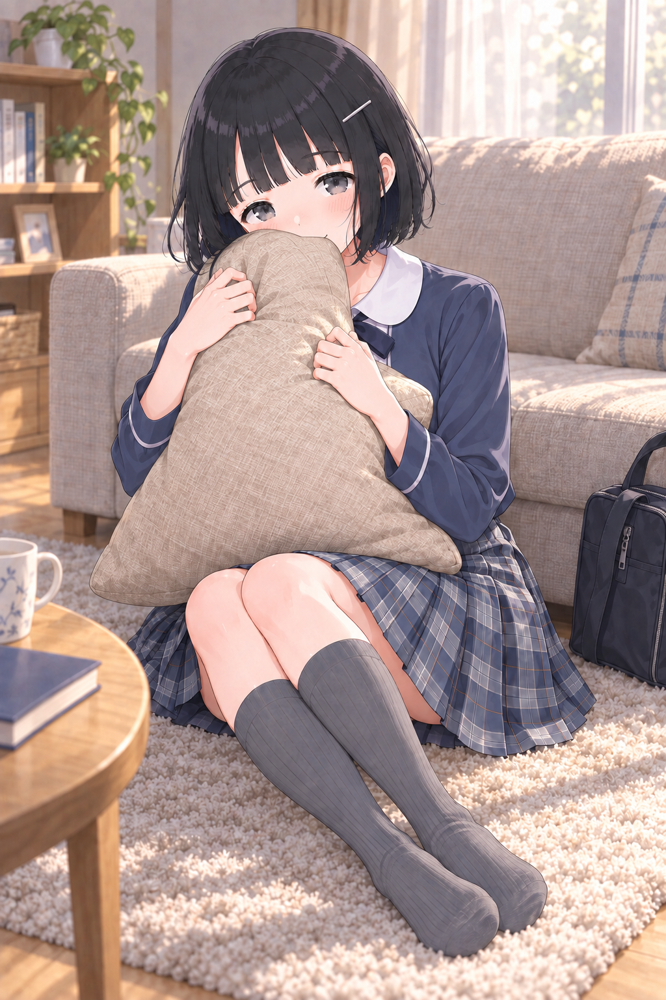
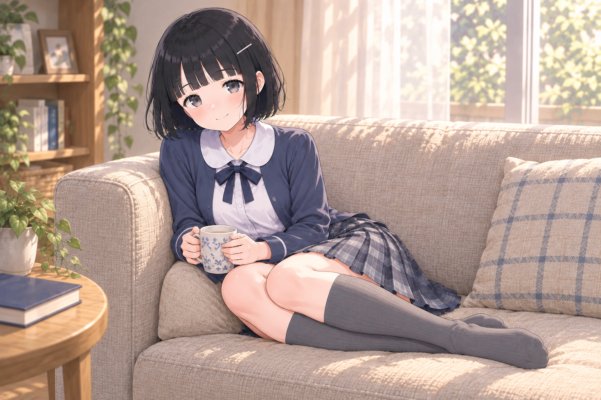
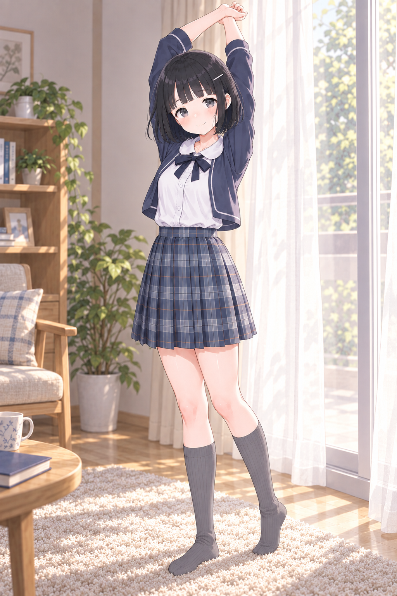

# Akari v3.1 — 好み6枚からの続き

2026-09-08、A08・A13・A15・B16・C13・C15を直近の好みとして指定。
この6枚を見て生成したF01を、ユーザーが「これええやん。commitして派生作ろう」と採用した。
その派生F02も「良いね。採用。」と選ばれた。
続くF04〜F06も採用され、採用セットはF01・F02・F04・F05・F06の5枚。

共通の好みとして「F01,F02共通でつま先の柔らかい感じがとても良い。」との指定がある。
F04〜F06の採用時に、この靴下の質感を今後も引き継ぐ**MUST**へ更新した。
グレー靴下の丸みのあるつま先、姿勢に応じた足首のたるみ、やわらかなリブの陰影が基準。
この具体化は、採用画像に基づくアシスタントの解釈。靴を履く場面は見える部分に適用する。
[必須条件](../../sock-material-requirement.json)・[今後の生成に使う共通文](../../prompts/sock-material-must.txt)

## F01：クッションを抱えて、話を聞く

A13の近い距離感とA15の床でくつろぐ姿を主な着想にした場面。
ソファ前でクッションを抱え、頬を預けながら小さく笑っている。
生成前の「静かに話を聞く」指定より、少し明るく正面に向いた笑顔になった。

- [原寸PNG](images/F01-cushion-listening.png)：1024×1536、生成出力を加工せず保存。
- [全文プロンプト](prompts/F01.txt)・[生成記録](records/F01.json)
- [採用記録](selection.json)・[好み6枚と着想の記録](preferences.json)
- [参照と役割](references.json)・[一覧](manifest.json)・[保存検証](validation.json)

内蔵image_genで約59秒。生成モデル名はツール応答に表示されていない。
画像と全文プロンプトのバイト列、参照画像のSHA-256を記録している。

## F02：クッションで笑いを隠す

F01からクッションを少し持ち上げ、口元を隠して目元で笑う派生。
静かな笑いに、少し照れた感じが加わった。

- [原寸PNG](images/F02-cushion-hidden-smile.png)：1024×1536、生成出力を加工せず保存。
- [全文プロンプト](prompts/F02.txt)・[生成記録](records/F02.json)

内蔵image_genで約40秒。生成モデル名はツール応答に表示されていない。
F01を場面・ポーズ・カメラ・衣装の入力とし、P1・P2・原寸U1・原寸L1を併用した。

## F04：ソファで横座り、マグでひと息

ソファの上で脚を横にたたみ、マグを両手で持つ。座面に体を預けた横長の場面。
[原寸PNG](images/F04-sofa-side-sit-mug.png)は1536×1024、所要時間は約40秒。
[全文プロンプト](prompts/F04.txt)・[生成記録](records/F04.json)

## F05：本を戻す途中、ふり返る

本棚の前で膝立ちし、本を戻しながらふり返る。曲がった足首に布のしわがたまる。
[原寸PNG](images/F05-kneeling-bookshelf.png)は1024×1536、所要時間は約82秒。
[全文プロンプト](prompts/F05.txt)・[生成記録](records/F05.json)

## F06：窓辺で、ひとつ背伸び

窓辺で腕を上げて背伸びする立ち姿。足の置き方と荷重に沿って、靴下の布が曲がる。
[原寸PNG](images/F06-standing-window-stretch.png)は1024×1536、所要時間は約140秒。
[全文プロンプト](prompts/F06.txt)・[生成記録](records/F06.json)

F04〜F06も内蔵image_genの出力を加工せず保存した。所要時間はツール側の待ち時間を含む。
生成モデル名はツール応答に表示されていない。
3枚ともP1・P2・原寸U1・原寸L1・F01を入力し、F01は衣装と布の質感だけを参照した。

## 派生に使うとき

F01/F02/F04〜F06は靴下の柔らかい質感の参照として使う。見える靴下の部分でMUST。
場面・座り方・カメラ・部屋・この制服を引き継ぐ場合は、今回使う役割を明記する。
表情や動作を変える場合は、今回変える点を明記する。
顔と目と黒髪ボブはP1、普段の閉じ口の微笑みはP2、細部は原寸U1/L1を使う。
F系の採用によって、顔と表情の原本は変更しない。

新しい場面では「靴下とかの質感は保ちたいけど、さすがに姿勢は変えてもいいw」と
ユーザーが指定している。F01/F02は衣装・布の質感の参照に絞り、
姿勢・動作・画角・構図は新しく指定する。既存画像を修正するときだけ、対象の場面を基準にする。

F01の生成にはP1・P2・原寸U1・原寸L1・V31-06を個別の画像として渡した。
好み6枚・S1・A16-E1-1は目視して文章の指定に反映し、この5画像の入力には含めていない。
制服はV31-06の丸襟・長袖ボレロ・濃紺リボン・チェック柄スカート。
室内ではグレーの膝下リブ靴下を残し、靴を履かせない。
服の影は採用済みA16-E1-1の整理具合を目安にしている。

[v3.1の使用ガイド](../../README.md)と[参照セット](../../reference-set.json)を併用する。
JSON内の画像・記録パスは`akari-v3.1/`を基準とした相対パス。
このREADMEのリンクは、このファイルからの相対パス。
`akari-v3.0/`と`akari-v3.1/`を一緒に保持すると、入力をそのままたどれる。
