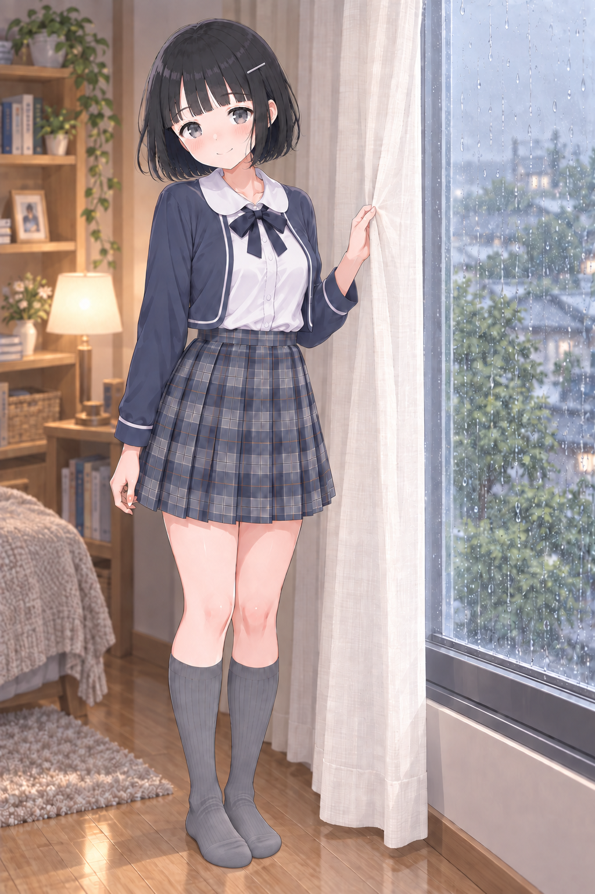
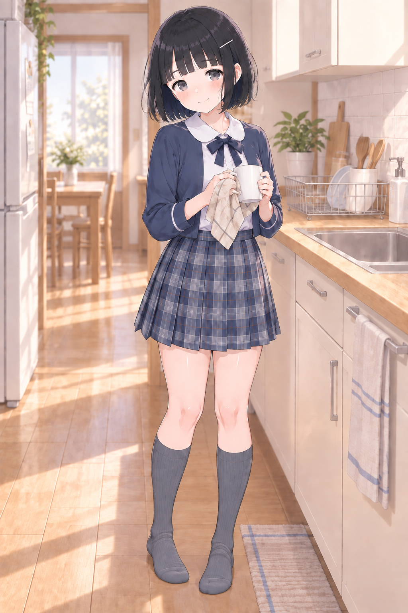
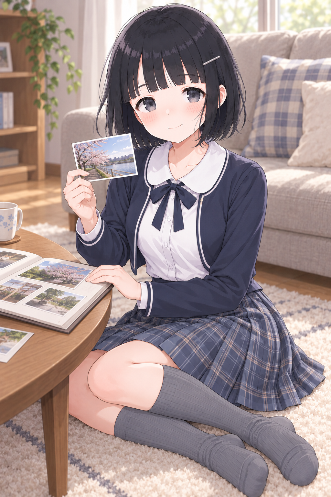
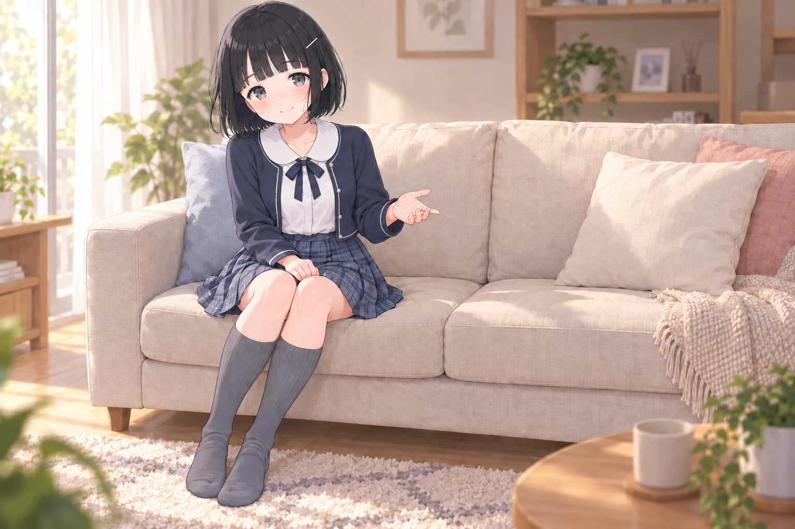
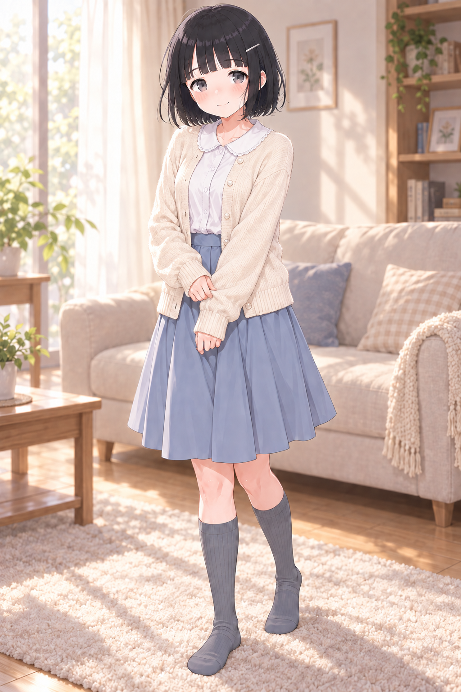

# Akari v3.1 — 好み6枚からの続き

2026-09-08、A08・A13・A15・B16・C13・C15を直近の好みとして指定。
この6枚を見て生成したF01を、ユーザーが「これええやん。commitして派生作ろう」と採用した。
その派生F02も「良いね。採用。」と選ばれた。
続くF04〜F06、窓辺のF08、台所のF09、写真を見せるF10も採用された。
ソファで誘うF11と、可愛い私服のF12も採用された。
採用セットはF01・F02・F04・F05・F06・F08・F09・F10・F11・F12の10枚。

共通の好みとして「F01,F02共通でつま先の柔らかい感じがとても良い。」との指定がある。
F04〜F06の採用時に、この靴下の質感を今後も引き継ぐ**MUST**へ更新した。
グレー靴下の丸みのあるつま先、姿勢に応じた足首のたるみ、やわらかなリブの陰影が基準。
つま先はF01・F07のように足指を透かさず丸い布で包み、布じわの量はF09程度を採用した。
F07は質感用の原寸保存のみで、この場面の採用一覧には含めていない。
靴を履く場面は見える部分に適用する。
[必須条件](../../sock-material-requirement.json)・[今後の生成に使う共通文](../../prompts/sock-material-must.txt)

## F01：クッションを抱えて、話を聞く

A13の近い距離感とA15の床でくつろぐ姿を主な着想にした場面。
ソファ前でクッションを抱え、頬を預けながら小さく笑っている。
生成前の「静かに話を聞く」指定より、少し明るく正面に向いた笑顔になった。

- [原寸PNG](images/F01-cushion-listening.png)：1024×1536、生成出力を加工せず保存。
- [全文プロンプト](prompts/F01.txt)・[生成記録](records/F01.json)
- [採用記録](selection.json)・[好み6枚と着想の記録](preferences.json)
- [参照と役割](references.json)・[一覧](manifest.json)・[保存検証](validation.json)

内蔵image_genで約59秒。生成モデル名はツール応答に表示されていない。
画像と全文プロンプトのバイト列、参照画像のSHA-256を記録している。

## F02：クッションで笑いを隠す

F01からクッションを少し持ち上げ、口元を隠して目元で笑う派生。
静かな笑いに、少し照れた感じが加わった。

- [原寸PNG](images/F02-cushion-hidden-smile.png)：1024×1536、生成出力を加工せず保存。
- [全文プロンプト](prompts/F02.txt)・[生成記録](records/F02.json)

内蔵image_genで約40秒。生成モデル名はツール応答に表示されていない。
F01を場面・ポーズ・カメラ・衣装の入力とし、P1・P2・原寸U1・原寸L1を併用した。

## F04：ソファで横座り、マグでひと息

ソファの上で脚を横にたたみ、マグを両手で持つ。座面に体を預けた横長の場面。
[原寸PNG](images/F04-sofa-side-sit-mug.png)は1536×1024、所要時間は約40秒。
[全文プロンプト](prompts/F04.txt)・[生成記録](records/F04.json)

## F05：本を戻す途中、ふり返る

本棚の前で膝立ちし、本を戻しながらふり返る。曲がった足首に布のしわがたまる。
[原寸PNG](images/F05-kneeling-bookshelf.png)は1024×1536、所要時間は約82秒。
[全文プロンプト](prompts/F05.txt)・[生成記録](records/F05.json)

## F06：窓辺で、ひとつ背伸び

窓辺で腕を上げて背伸びする立ち姿。足の置き方と荷重に沿って、靴下の布が曲がる。
[原寸PNG](images/F06-standing-window-stretch.png)は1024×1536、所要時間は約140秒。
[全文プロンプト](prompts/F06.txt)・[生成記録](records/F06.json)

F04〜F06も内蔵image_genの出力を加工せず保存した。所要時間はツール側の待ち時間を含む。
生成モデル名はツール応答に表示されていない。
3枚ともP1・P2・原寸U1・原寸L1・F01を入力し、F01は衣装と布の質感だけを参照した。

## F08：雨、まだ止まないね

雨の窓辺でカーテンの端を左手でつまみ、こちらを見る。
腕と手の向きを見直して新規生成した構図に、丸く不透明なつま先と浅い布じわを反映した。
今回の最新しわ追加版を採用。しわの量を今後の基準にするときはF09を優先する。

- [原寸PNG](images/F08-rain-at-window.png)：1024×1536、生成出力を加工せず保存。
- [全文プロンプト](prompts/F08.txt)・[生成記録](records/F08.json)・[足元の拡大](previews/F08-sock-detail.png)

## F09：話の続き、聞いてる

台所でマグを布巾で拭きながら、こちらの話を聞いている。
腰・膝・足先のつながりが見える全身構図と、膝下丈の靴下を使用。
ユーザーが「F09ぐらいがええな」と選んだ、丸く不透明なつま先と控えめな布じわの優先基準。

- [原寸PNG](images/F09-drying-mug-listening.png)：1024×1536、生成出力を加工せず保存。
- [全文プロンプト](prompts/F09.txt)・[生成記録](records/F09.json)
- [質感用の足元詳細](../../references/materials/F09-rounded-wrinkled-sock-detail.png)・[質感の採用記録](../../history/F09-sock-material-selection.json)

F08・F09の最終しわ追加は、内蔵image_genでそれぞれ約57秒・約54秒。
モデル名はツール応答に表示されていない。
[入力画像から最終版までの生成記録](history/F08-F09/generation-chain.json)と
[ユーザーの指摘・採用記録](history/F08-F09/user-feedback.json)を保存した。
実際に使った親画像・切り出し画像・全文プロンプトを相対パスでたどれる。

## F10：この写真、見て

ローテーブルで写真をアルバムへ並べながら、見つけた1枚をこちらへ見せる室内シーン。
床に横座りした全身、丸襟・長袖ボレロ・チェック柄スカート、靴を脱いだグレー靴下を使用。
P1/P2・原寸U1/L1・F09足元詳細を直接入力し、F09全身とA16-E1-1は衣装と仕上げの目視補助にした。

- [原寸PNG](images/F10-showing-a-photo.png)：1024×1536、生成出力を加工せず保存。
- [全文プロンプト](prompts/F10.txt)・[生成記録](records/F10.json)
- [採用時の検証](history/F10-adoption-validation.json)

靴下は不透明な丸いつま先を保ち、足指の分離はない。足首から前足部のしわは
F09の優先基準よりやや強いため、F10を靴下の新しい原本には昇格しない。
顔・表情の原本も引き続きP1/P2を使う。

## F11：ここ、座る？

ソファの隣を空け、小さく手招きする横長の生活シーン。
丸襟・長袖ボレロ・チェック柄スカートを引き継ぎ、つま先を修正したr2を採用した。
ボレロの小さなボタンはF10と異なる。F09を靴下の質感基準として継続する。

- [原寸PNG](images/F11-sofa-invitation.png)：1536×1024。
- [最終修正プロンプト](prompts/F11.txt)・[採用記録](records/F11.json)
- [初回画像・全文プロンプト・入力を含む生成履歴](history/F11/generation-chain.json)
- [足元の拡大](previews/F11-sock-detail.png)

## F12：この服、どうかな？

ユーザーの「可愛い系」「おすすめで」の指定から、アイボリーのカーディガン、
小さなレース縁の丸襟、くすみブルーの膝丈フレアスカートを選んだ。
袖口に手を添える立ち姿。グレー靴下の指状の凹凸を修正したr2を採用した。
この私服を使う場面ではF12を衣装参照にできる。顔・表情の原本はP1/P2、
上半身と脚の細部は原寸U1/L1、靴下の質感はF09を継続する。

- [原寸PNG](images/F12-cute-cardigan.png)：1024×1536。
- [最終修正プロンプト](prompts/F12.txt)・[採用記録](records/F12.json)
- [初回画像・全文プロンプト・入力を含む生成履歴](history/F12/generation-chain.json)
- [足元の拡大](previews/F12-sock-detail.png)

2枚とも内蔵image_genの出力を加工せず保存した。生成・修正はF11が約106秒、
F12が約124秒。モデル名はツール応答に表示されていない。
[今回の保存検証](history/F11-F12-adoption-validation.json)に整合性確認を記録する。

## 派生に使うとき

見える靴下の柔らかい質感はMUST。今後はF09の足元詳細を優先入力にし、
丸く不透明なつま先と、控えめな自然な布じわを両立する。
F01/F02/F04〜F06と、別途保存したF07も質感の比較用に使える。
場面・座り方・カメラ・部屋・この制服を引き継ぐ場合は、今回使う役割を明記する。
表情や動作を変える場合は、今回変える点を明記する。
顔と目と黒髪ボブはP1、普段の閉じ口の微笑みはP2、細部は原寸U1/L1を使う。
F系の採用によって、顔と表情の原本は変更しない。

新しい場面では「靴下とかの質感は保ちたいけど、さすがに姿勢は変えてもいいw」と
ユーザーが指定している。F01/F02は衣装・布の質感の参照に絞り、
姿勢・動作・画角・構図は新しく指定する。既存画像を修正するときだけ、対象の場面を基準にする。

F01の生成にはP1・P2・原寸U1・原寸L1・V31-06を個別の画像として渡した。
好み6枚・S1・A16-E1-1は目視して文章の指定に反映し、この5画像の入力には含めていない。
制服はV31-06の丸襟・長袖ボレロ・濃紺リボン・チェック柄スカート。
室内ではグレーの膝下リブ靴下を残し、靴を履かせない。
服の影は採用済みA16-E1-1の整理具合を目安にしている。

[v3.1の使用ガイド](../../README.md)と[参照セット](../../reference-set.json)を併用する。
JSON内の画像・記録パスは`akari-v3.1/`を基準とした相対パス。
このREADMEのリンクは、このファイルからの相対パス。
`akari-v3.0/`と`akari-v3.1/`を一緒に保持すると、入力をそのままたどれる。
