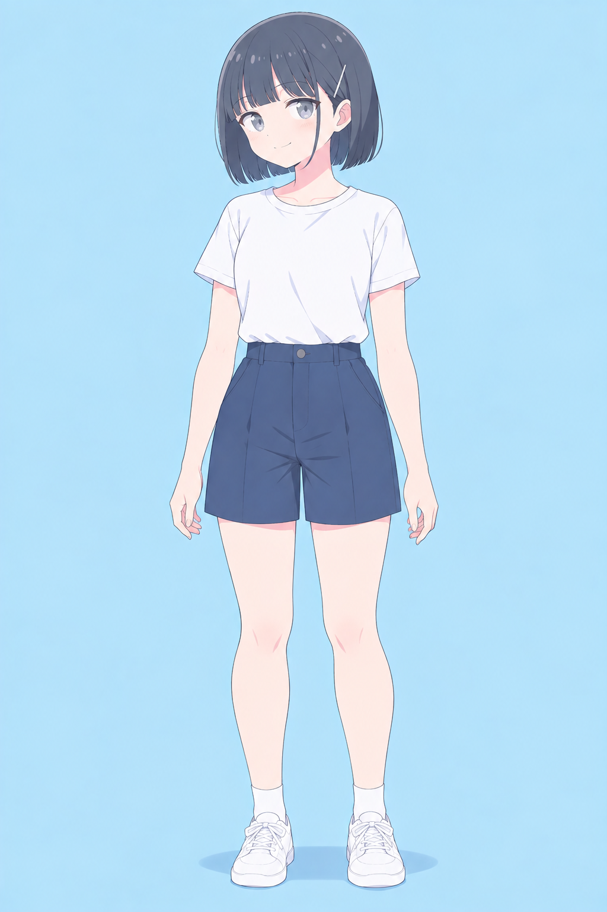

# Akari V4.0 — V11の顔とB06の全身

2026-09-22、ユーザーが全身8候補から「B06にしよう」と選択しました。
好みとして選ばれたNovelAI V5 CuratedのV11を顔と描き方、B06を体格の基準として採用します。

## 基準画像

| ID | 原寸PNG | 役割 |
| --- | --- | --- |
| V11 | [顔の基準](references/V11-novelai-v5-curated.png)・832×1216 | 顔、グレーの目、ボブ、銀ピン、線と塗り |
| B06 | [全身の基準](references/B06-full-body.png)・1024×1536 | 体格、四肢の丸み、全身のバランス |

V11はNovelAIの文章から、B06はChatGPTの6 Pro表示の会話で制作しました。
ChatGPT内部の画像生成モデル名と、内部で実際に採用された参照画像は確認できません。

## 保つ特徴

- V11のやわらかい頬と輪郭、大きく丸いグレーの目、少し下がった目尻。
- 顎までの黒〜青みグレーのボブ、前髪、頬に沿う細い横髪。
- 一本の細い銀色の直線ピン。本人の左耳の上、正面では画面右側。
- 細く軽い線、淡い色面、浅いセル影、控えめな頬色。
- B06のすらっとした四肢と、上腕・腿・ふくらはぎの柔らかい丸み。

体格はB06の画像そのものを基準にします。
生成時の「約7.25頭身」は探索の方向を伝えた数値で、出力を実測した値ではありません。
実際の候補では長さより四肢の厚みの差が分かりやすく出ています。

## 衣装と場面の広げ方

B06の白いTシャツ、ネイビーのショートパンツ、白ソックスとスニーカーは体格比較用の衣装です。
V4.0の固定制服にはせず、衣装・場面・ポーズ・カメラ・表情は依頼ごとに指定します。
ユーザーの指定に従い、年齢の数値や成人女性を示す語をプロンプトへ付け足しません。

生成前にV11とB06の原寸を開き、担当する特徴をプロンプトに明記します。
B06や場面絵の小さい顔でV11を置き換えず、毎回同じV11/B06から独立して生成します。
既存画像の修正では対象画像に構図・ポーズ・カメラの役割を持たせ、V11/B06は担当する特徴を補います。
靴下が見えるときは柔らかく不透明な布と浅いしわを保ち、靴で隠れたつま先を無理に描きません。

[場面用のプロンプト](prompts/scene-base.txt)と[参照セット](reference-set.json)を再利用できます。
過去の版は来歴として残し、V4.0ではV11/B06を優先します。

## 保存した場面例

[衣装と場面の4作例](situations/outfits-scenes/README.md)に、カフェ、本屋、公園、海辺を保存しました。
これらはB06の選択前にV11から制作した上半身の例です。
B06を別衣装や別ポーズへ展開した検証画像ではなく、顔や体格の基準を置き換えるものでもありません。

## 記録と検証

- [選択の経緯](selection.json)・[設計状態](design-state.json)
- [8候補の比較記録](history/body-selection.json)
- [生成来歴](history/generation.json)・[保存と参照先の検証](validation.json)
- [V11入力文](prompts/V11-novelai.txt)・[除外指定](prompts/V11-negative.txt)・[B06生成文](prompts/B06.txt)

選択した2枚と4作例は生成元のPNGを再圧縮せず保存し、SHA-256と原寸を記録しています。
未選択の全身7候補は採用せず、候補ID・ハッシュ・目視所見を比較記録に残しています。
表情や画角を広げた場合の再現性は、今後の画像ごとに確認します。
既定の設定PDFは引き続き[Akari v1.2 Natural Form](../akari-v1.2/release/akari-v1.2-core-settings.pdf)です。
