# となりの表情

<!-- markdownlint-disable MD033 -->

Akari v1.1 expression booklet / Markdown edition

Generated from <code>evidence/tonari-no-hyoujou/reviews/20260703_draft-map-review.json</code> on 2026-07-06.

## はじめに

「となりの表情」は、あかりの近い距離の反応を集めた表情冊子です。大きなドラマよりも、呼ばれた瞬間、目が合った一拍、照れ隠し、安心、眠気、言いかけた言葉の手前にある小さな動きを残しています。

本編18表情に、追加の豊かめなバストアップ8表情を加えた完成版です。Humanization済みで採用記録がある表情は完成画像を使い、それ以外は最新の選定候補を掲載しています。

<figure>
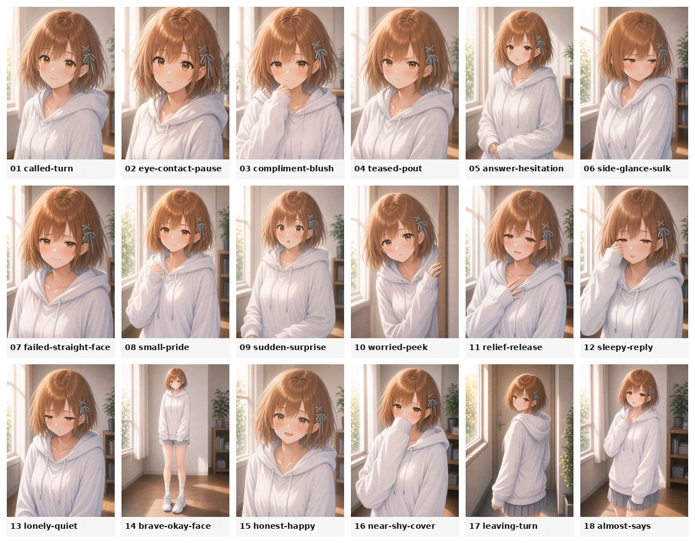
<figcaption>本編18表情の選定一覧</figcaption>
</figure>
<figure>
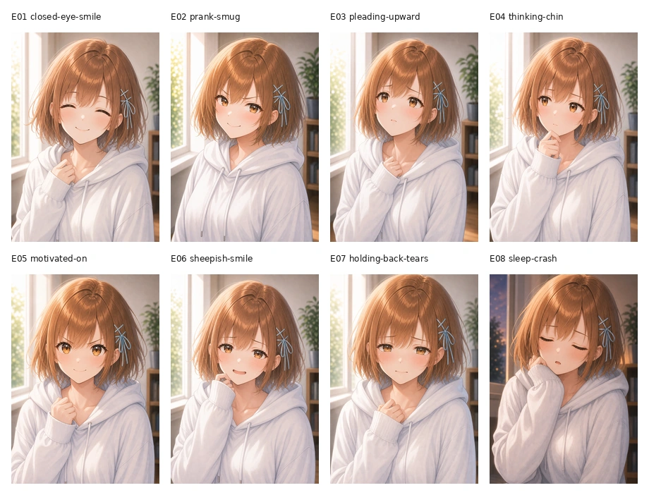
<figcaption>追加8表情の選定一覧</figcaption>
</figure>

## 目次

### 本編

- [01. 呼ばれて振り向く](#01-called-turn)
- [02. 目が合って止まる](#02-eye-contact-pause)
- [03. 褒められて照れる](#03-compliment-blush)
- [04. からかわれてむっとする](#04-teased-pout)
- [05. 言い返す前](#05-answer-hesitation)
- [06. 拗ねた目線](#06-side-glance-sulk)
- [07. でも笑ってしまう](#07-failed-straight-face)
- [08. 小さく得意げ](#08-small-pride)
- [09. 不意に驚く](#09-sudden-surprise)
- [10. 心配そうに覗く](#10-worried-peek)
- [11. 安心して力が抜ける](#11-relief-release)
- [12. 眠たげに返事する](#12-sleepy-reply)
- [13. 少し寂しそう](#13-lonely-quiet)
- [14. 平気な顔をする](#14-brave-okay-face)
- [15. 素直に嬉しい顔](#15-honest-happy)
- [16. 近距離の照れ隠し](#16-near-shy-cover)
- [17. 帰り際に振り向く](#17-leaving-turn)
- [18. 何か言いかけて笑う](#18-almost-says)

### 追加表情

- [E01. にっこり目を閉じて笑う（安心・日常）](#19-extra-closed-eye-smile)
- [E02. いたずら成功のドヤ顔](#20-extra-prank-smug)
- [E03. お願い・上目遣い](#21-extra-pleading-upward)
- [E04. 考え込み（顎に手）](#22-extra-thinking-chin)
- [E05. やる気スイッチON](#23-extra-motivated-on)
- [E06. やっちゃった…苦笑い](#24-extra-sheepish-smile)
- [E07. 泣きそうだけど我慢](#25-extra-holding-back-tears)
- [E08. 完全寝落ち寸前](#26-extra-sleep-crash)

## 本編 18 表情

<section class="expression-page" id="01-called-turn">

01 / 本編 18 表情

<h3>呼ばれて振り向く</h3>

called-turn

<figure>
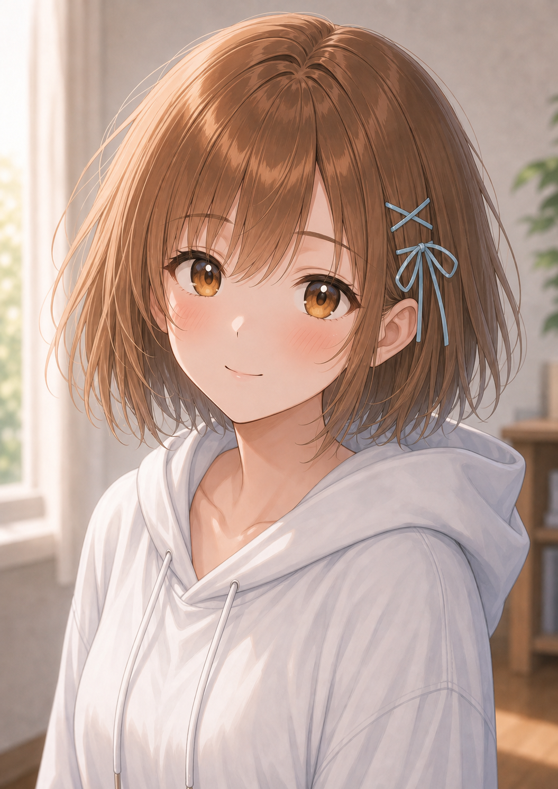
<figcaption>呼ばれた声に、少しだけ遅れてこちらを見る。</figcaption>
</figure>

<code>source/finished/tonari-no-hyoujou/20260703_called-turn_v2_humanization_H03_v1.png</code>

</section>

<section class="expression-page" id="02-eye-contact-pause">

02 / 本編 18 表情

<h3>目が合って止まる</h3>

eye-contact-pause

<figure>
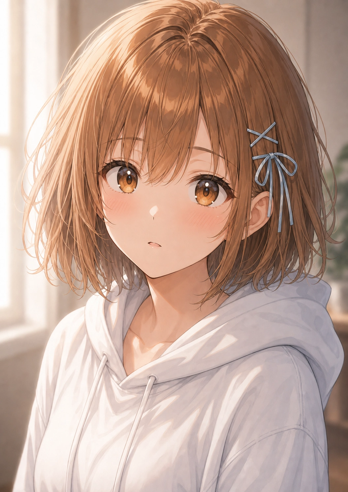
<figcaption>目が合って、言葉にする前の一拍だけ止まる。</figcaption>
</figure>

<code>source/generated/tonari-no-hyoujou/20260703_eye-contact-pause_v1.webp</code>

</section>

<section class="expression-page" id="03-compliment-blush">

03 / 本編 18 表情

<h3>褒められて照れる</h3>

compliment-blush

<figure>
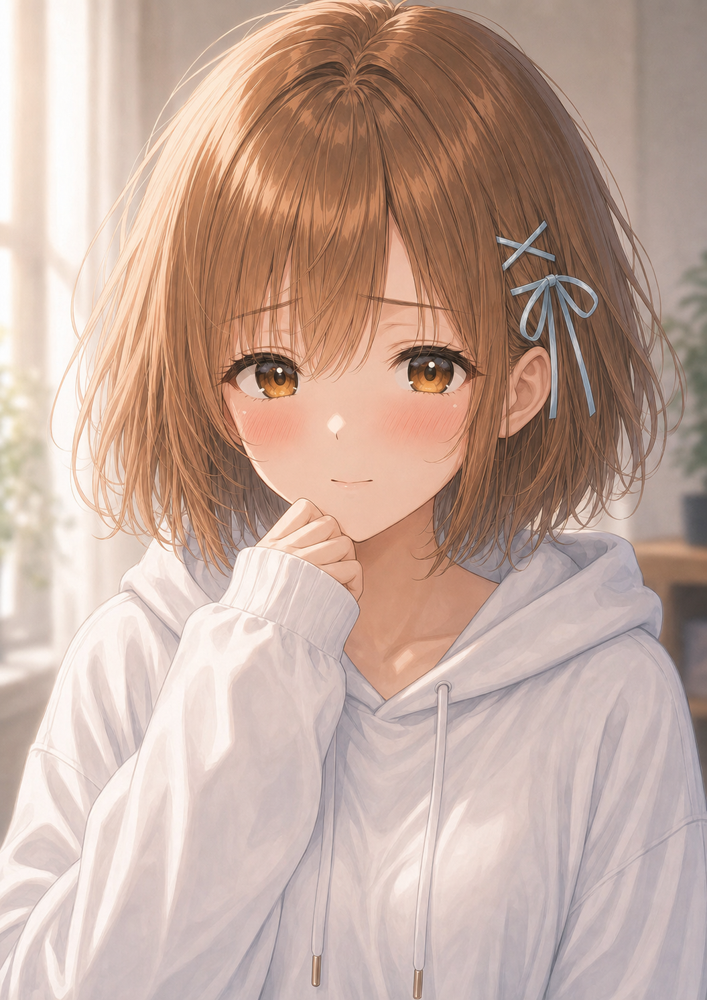
<figcaption>うれしいのに、すぐには認めたくない照れ。</figcaption>
</figure>

<code>source/finished/tonari-no-hyoujou/20260703_compliment-blush_v1_humanization_H05_v1.png</code>

</section>

<section class="expression-page" id="04-teased-pout">

04 / 本編 18 表情

<h3>からかわれてむっとする</h3>

teased-pout

<figure>
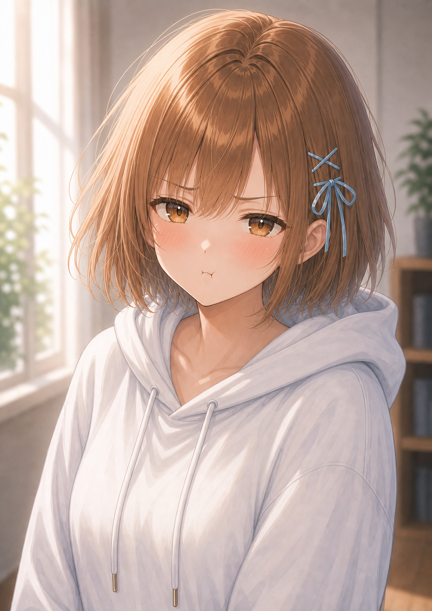
<figcaption>からかわれて、ほんの少しだけむっとする。</figcaption>
</figure>

<code>source/finished/tonari-no-hyoujou/20260703_teased-pout_v1_humanization_H05_v1.png</code>

</section>

<section class="expression-page" id="05-answer-hesitation">

05 / 本編 18 表情

<h3>言い返す前</h3>

answer-hesitation

<figure>
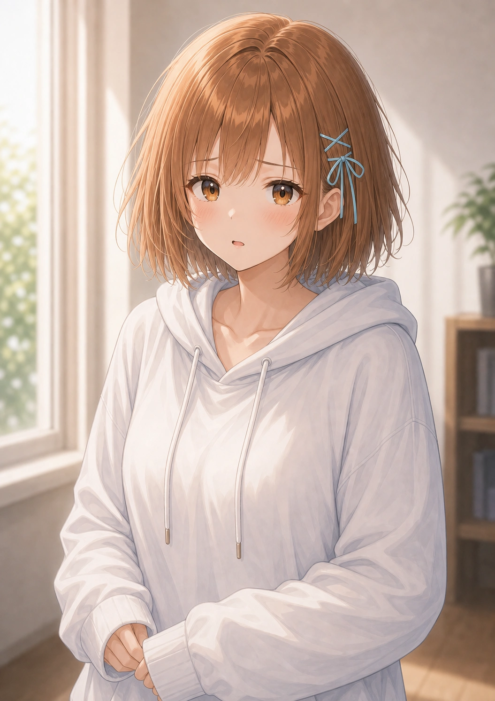
<figcaption>言い返そうとして、言葉を選び直している。</figcaption>
</figure>

<code>source/generated/tonari-no-hyoujou/20260703_answer-hesitation_v1.webp</code>

</section>

<section class="expression-page" id="06-side-glance-sulk">

06 / 本編 18 表情

<h3>拗ねた目線</h3>

side-glance-sulk

<figure>
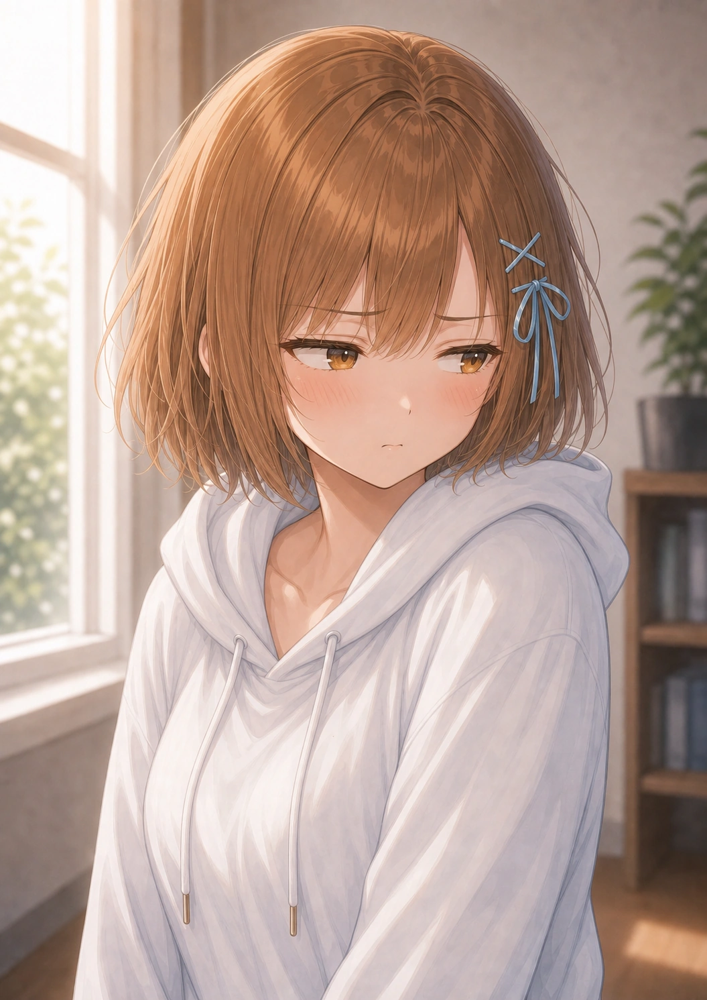
<figcaption>横を向いているけれど、まだちゃんと聞いている。</figcaption>
</figure>

<code>source/generated/tonari-no-hyoujou/20260705_side-glance-sulk_v2.webp</code>

</section>

<section class="expression-page" id="07-failed-straight-face">

07 / 本編 18 表情

<h3>でも笑ってしまう</h3>

failed-straight-face

<figure>
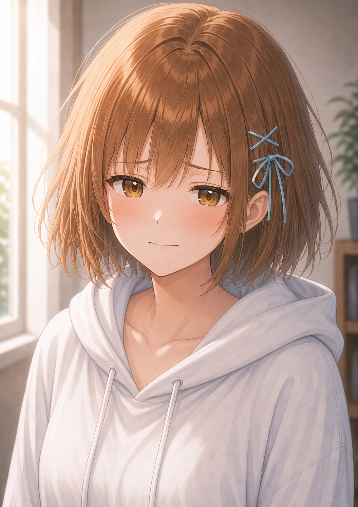
<figcaption>平静を保つつもりが、少しだけ笑ってしまう。</figcaption>
</figure>

<code>source/generated/tonari-no-hyoujou/20260705_failed-straight-face_v2.webp</code>

</section>

<section class="expression-page" id="08-small-pride">

08 / 本編 18 表情

<h3>小さく得意げ</h3>

small-pride

<figure>
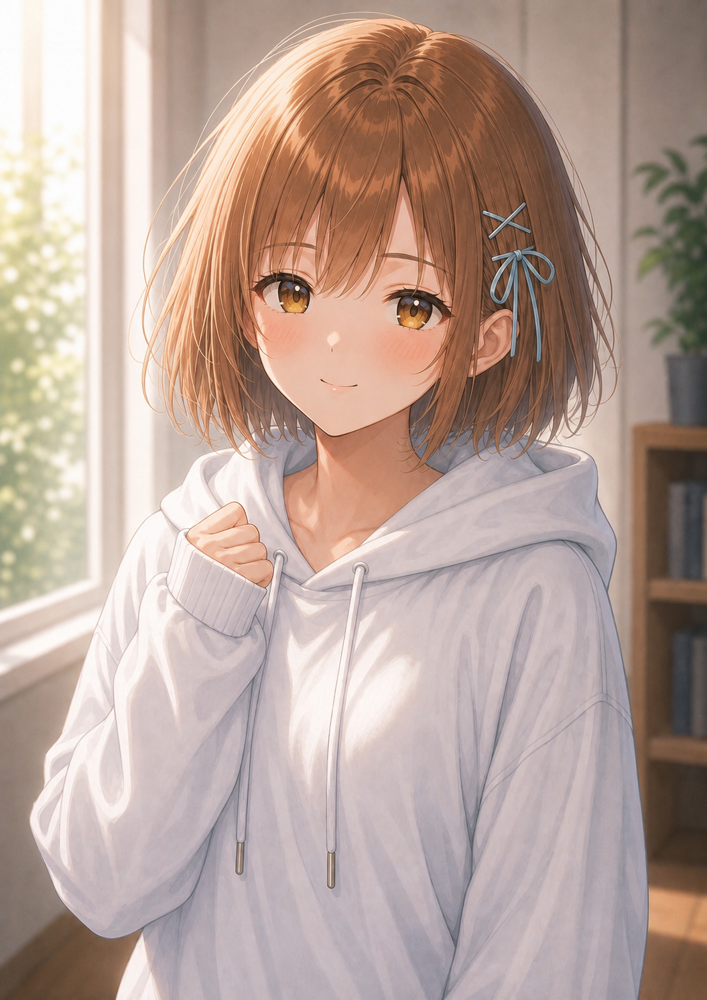
<figcaption>大きくは言わない、小さな得意げ。</figcaption>
</figure>

<code>source/finished/tonari-no-hyoujou/20260703_small-pride_v1_humanization_H05_v1.png</code>

</section>

<section class="expression-page" id="09-sudden-surprise">

09 / 本編 18 表情

<h3>不意に驚く</h3>

sudden-surprise

<figure>
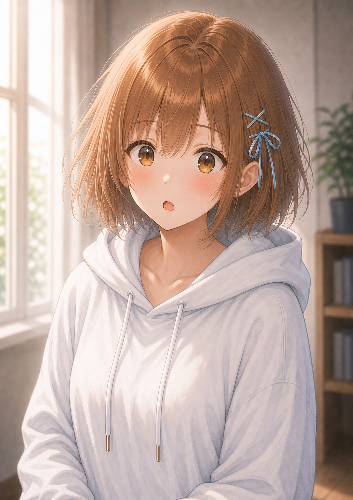
<figcaption>思っていなかったことに、素直に目を開く。</figcaption>
</figure>

<code>source/finished/tonari-no-hyoujou/20260703_sudden-surprise_v1_humanization_H05_v1.png</code>

</section>

<section class="expression-page" id="10-worried-peek">

10 / 本編 18 表情

<h3>心配そうに覗く</h3>

worried-peek

<figure>
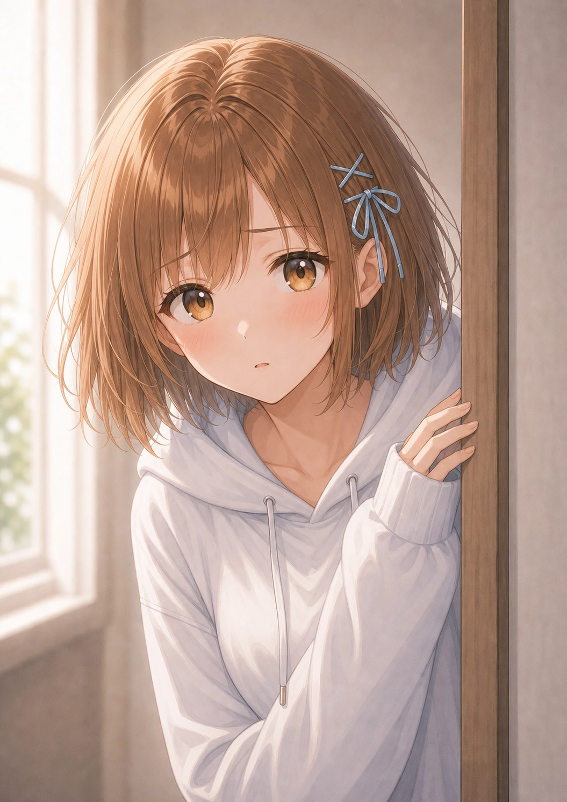
<figcaption>近くまで来て、心配そうに様子をうかがう。</figcaption>
</figure>

<code>source/generated/tonari-no-hyoujou/20260703_worried-peek_v1.webp</code>

</section>

<section class="expression-page" id="11-relief-release">

11 / 本編 18 表情

<h3>安心して力が抜ける</h3>

relief-release

<figure>
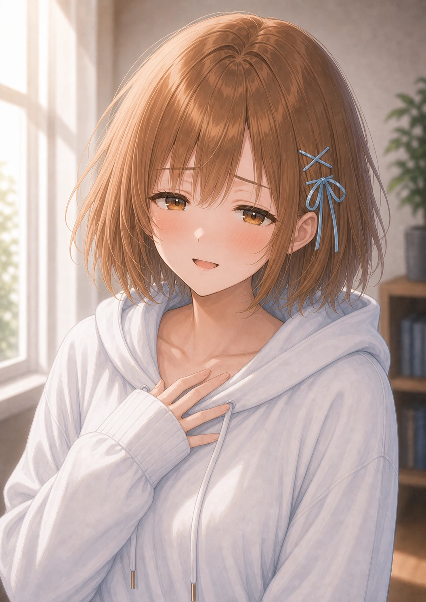
<figcaption>緊張がほどけて、肩と表情の力が抜ける。</figcaption>
</figure>

<code>source/generated/tonari-no-hyoujou/20260705_relief-release_v2.webp</code>

</section>

<section class="expression-page" id="12-sleepy-reply">

12 / 本編 18 表情

<h3>眠たげに返事する</h3>

sleepy-reply

<figure>
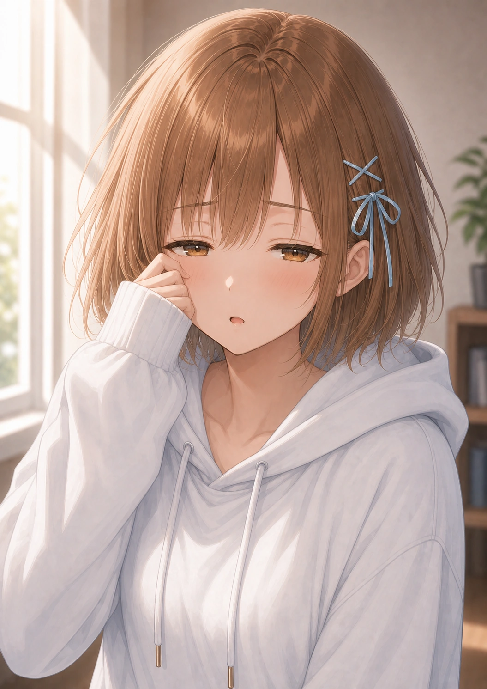
<figcaption>眠気を残したまま、やさしく返事をする。</figcaption>
</figure>

<code>source/generated/tonari-no-hyoujou/20260705_sleepy-reply_v3.webp</code>

</section>

<section class="expression-page" id="13-lonely-quiet">

13 / 本編 18 表情

<h3>少し寂しそう</h3>

lonely-quiet

<figure>
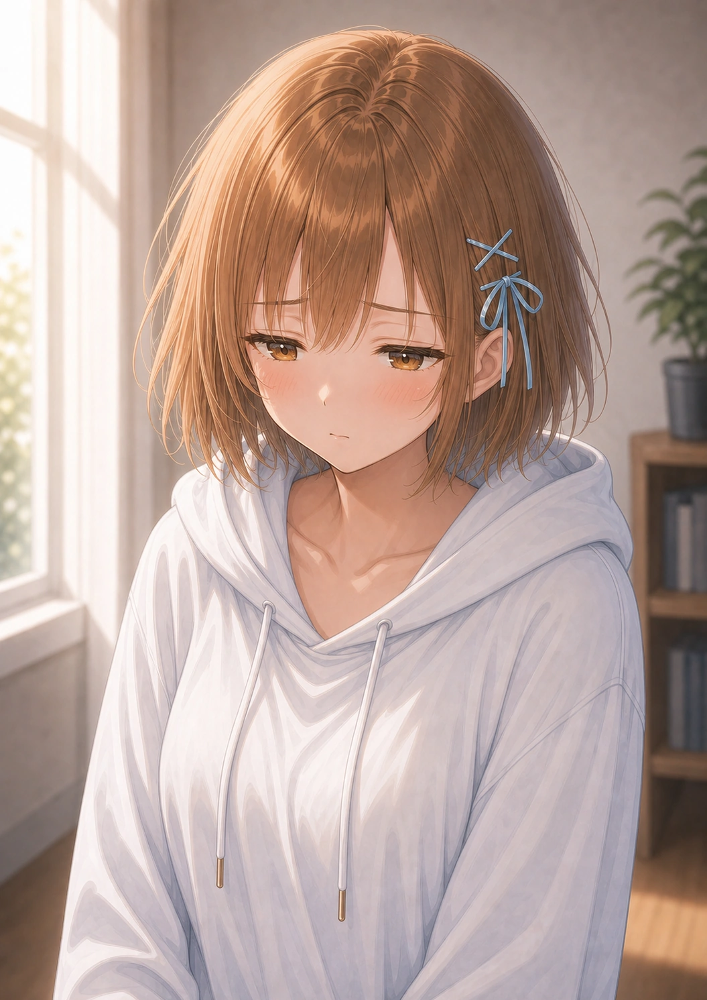
<figcaption>ふと会話の温度が下がる、静かな寂しさ。</figcaption>
</figure>

<code>source/generated/tonari-no-hyoujou/20260705_lonely-quiet_v3.webp</code>

</section>

<section class="expression-page" id="14-brave-okay-face">

14 / 本編 18 表情

<h3>平気な顔をする</h3>

brave-okay-face

<figure>
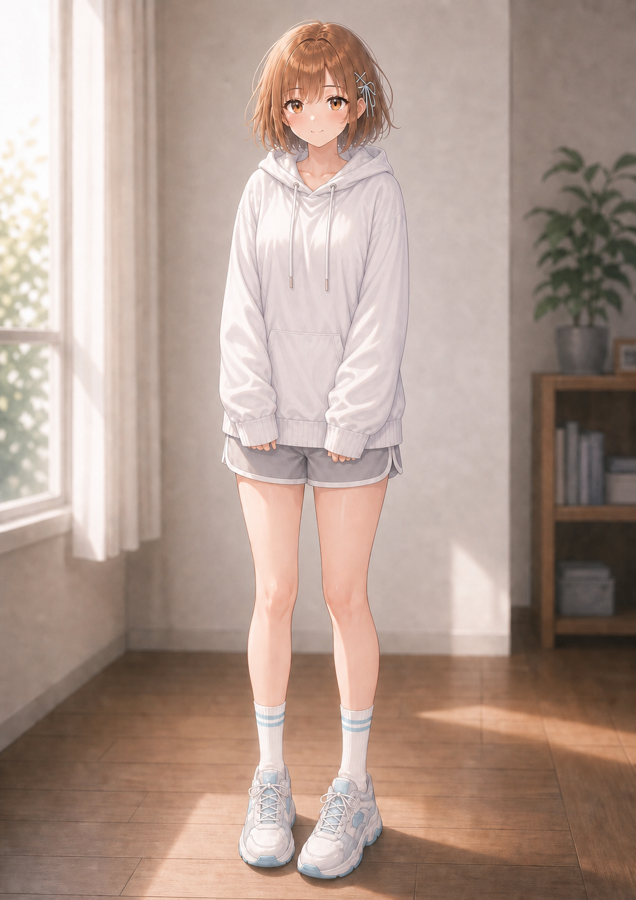
<figcaption>平気だと言うために、少しだけ背筋を伸ばす。</figcaption>
</figure>

<code>source/finished/tonari-no-hyoujou/20260703_brave-okay-face_v1_humanization_H03_v1.png</code>

</section>

<section class="expression-page" id="15-honest-happy">

15 / 本編 18 表情

<h3>素直に嬉しい顔</h3>

honest-happy

<figure>
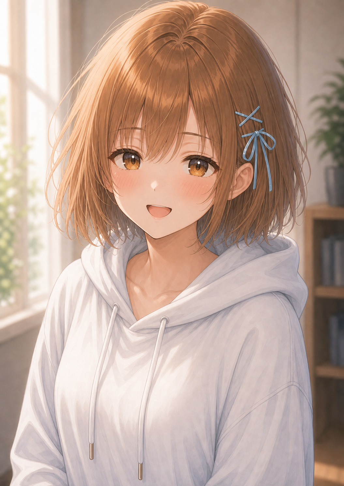
<figcaption>隠しきらず、まっすぐに嬉しい顔をする。</figcaption>
</figure>

<code>source/finished/tonari-no-hyoujou/20260703_honest-happy_v1_humanization_H03_v1.png</code>

</section>

<section class="expression-page" id="16-near-shy-cover">

16 / 本編 18 表情

<h3>近距離の照れ隠し</h3>

near-shy-cover

<figure>
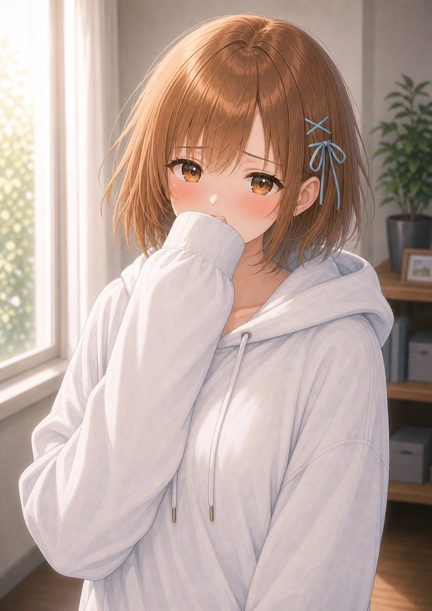
<figcaption>近すぎる距離を、袖と視線で少しだけ隠す。</figcaption>
</figure>

<code>source/generated/tonari-no-hyoujou/20260705_near-shy-cover_v3.webp</code>

</section>

<section class="expression-page" id="17-leaving-turn">

17 / 本編 18 表情

<h3>帰り際に振り向く</h3>

leaving-turn

<figure>
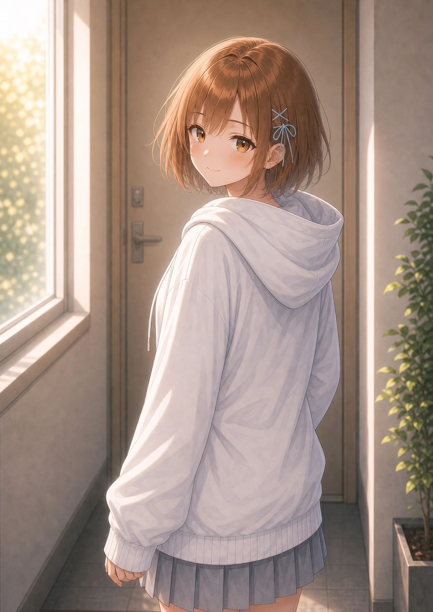
<figcaption>帰り際、もう一度だけこちらを振り向く。</figcaption>
</figure>

<code>source/generated/tonari-no-hyoujou/20260705_leaving-turn_v4.webp</code>

</section>

<section class="expression-page" id="18-almost-says">

18 / 本編 18 表情

<h3>何か言いかけて笑う</h3>

almost-says

<figure>
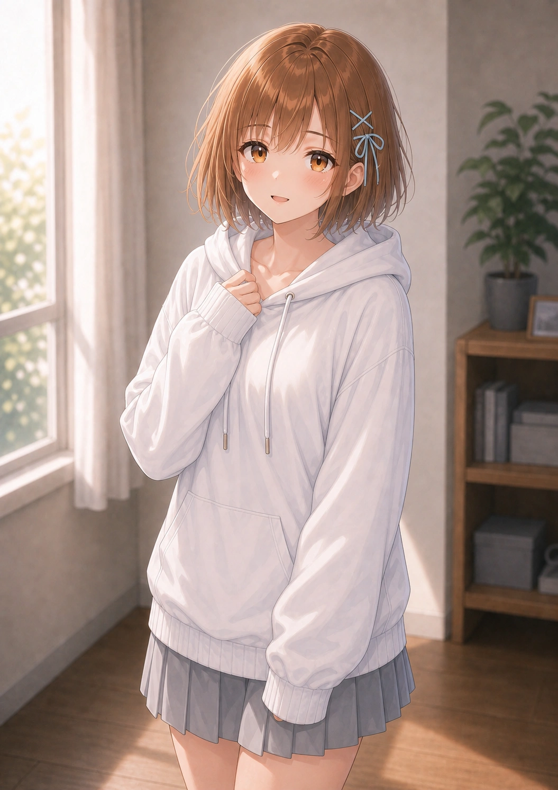
<figcaption>言いかけた言葉を、笑顔の手前に残す。</figcaption>
</figure>

<code>source/generated/tonari-no-hyoujou/20260704_almost-says_v2.webp</code>

</section>

## 追加 8 表情

<section class="expression-page" id="19-extra-closed-eye-smile">

E01 / 追加 8 表情

<h3>にっこり目を閉じて笑う（安心・日常）</h3>

extra-closed-eye-smile

<figure>
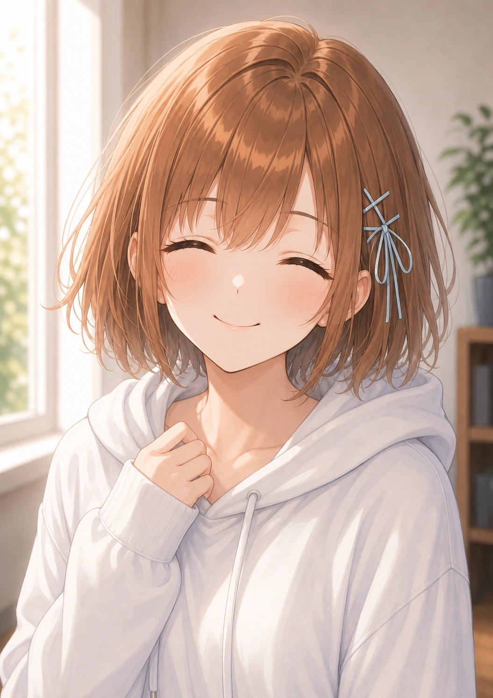
<figcaption>目を閉じて、安心した日常の笑顔になる。</figcaption>
</figure>

<code>source/generated/tonari-no-hyoujou/20260705_extra-01_closed-eye-smile_v1.webp</code>

</section>

<section class="expression-page" id="20-extra-prank-smug">

E02 / 追加 8 表情

<h3>いたずら成功のドヤ顔</h3>

extra-prank-smug

<figure>
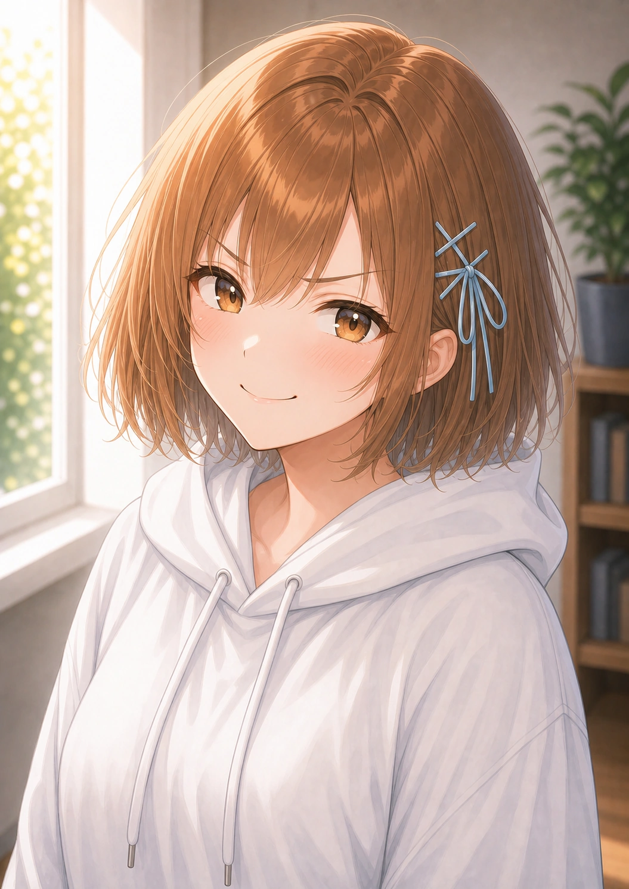
<figcaption>いたずらが成功して、ほんの少しだけ得意げ。</figcaption>
</figure>

<code>source/generated/tonari-no-hyoujou/20260706_extra-02_prank-smug_v5.webp</code>

</section>

<section class="expression-page" id="21-extra-pleading-upward">

E03 / 追加 8 表情

<h3>お願い・上目遣い</h3>

extra-pleading-upward

<figure>
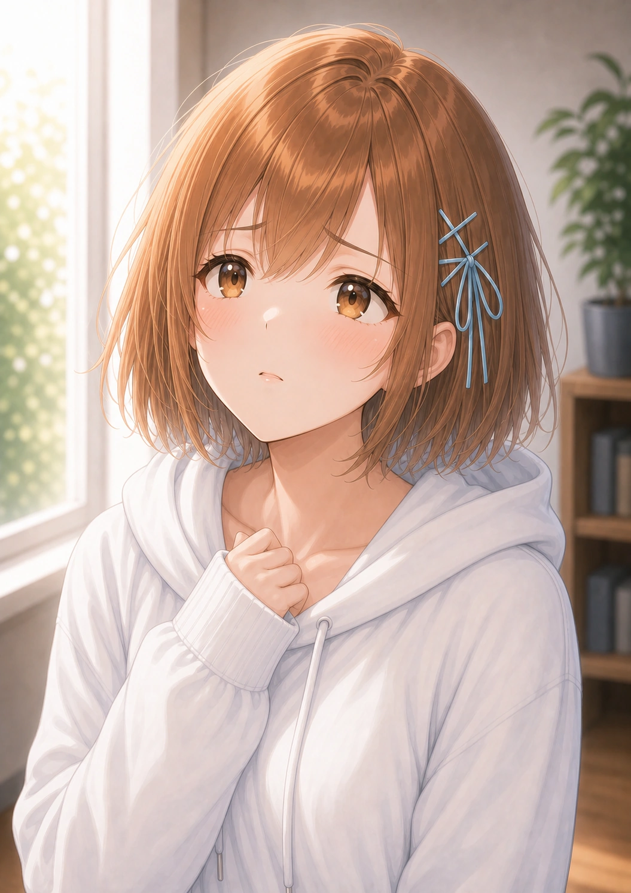
<figcaption>頼みごとをする前の、控えめな上目遣い。</figcaption>
</figure>

<code>source/generated/tonari-no-hyoujou/20260706_extra-03_pleading-upward_v2.webp</code>

</section>

<section class="expression-page" id="22-extra-thinking-chin">

E04 / 追加 8 表情

<h3>考え込み（顎に手）</h3>

extra-thinking-chin

<figure>
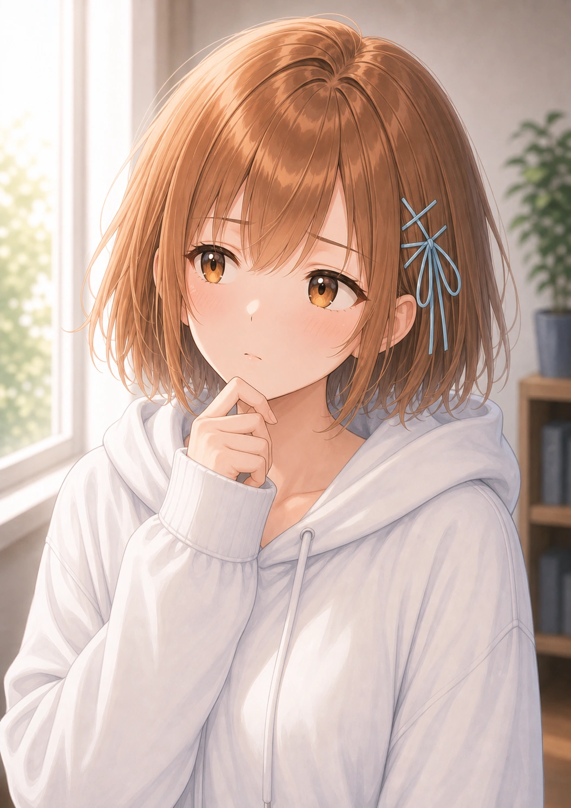
<figcaption>考えがまとまるまで、顎に手を添える。</figcaption>
</figure>

<code>source/generated/tonari-no-hyoujou/20260705_extra-04_thinking-chin_v1.webp</code>

</section>

<section class="expression-page" id="23-extra-motivated-on">

E05 / 追加 8 表情

<h3>やる気スイッチON</h3>

extra-motivated-on

<figure>
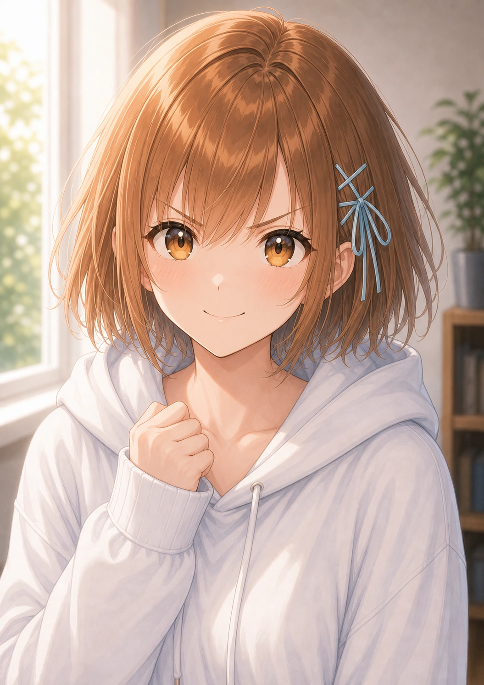
<figcaption>よし、と小さく気持ちが切り替わる。</figcaption>
</figure>

<code>source/generated/tonari-no-hyoujou/20260705_extra-05_motivated-on_v2.webp</code>

</section>

<section class="expression-page" id="24-extra-sheepish-smile">

E06 / 追加 8 表情

<h3>やっちゃった…苦笑い</h3>

extra-sheepish-smile

<figure>
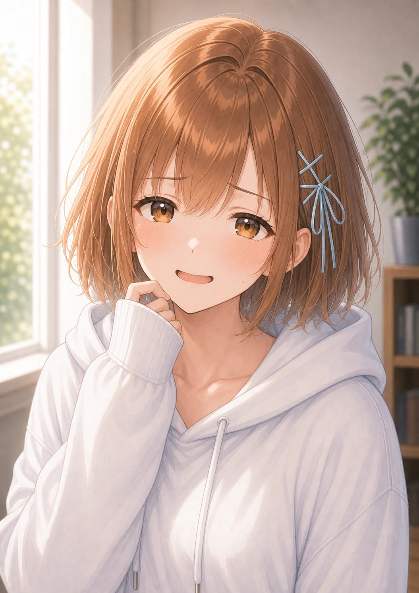
<figcaption>やってしまった、と笑ってごまかす苦笑い。</figcaption>
</figure>

<code>source/generated/tonari-no-hyoujou/20260705_extra-06_sheepish-smile_v2.webp</code>

</section>

<section class="expression-page" id="25-extra-holding-back-tears">

E07 / 追加 8 表情

<h3>泣きそうだけど我慢</h3>

extra-holding-back-tears

<figure>
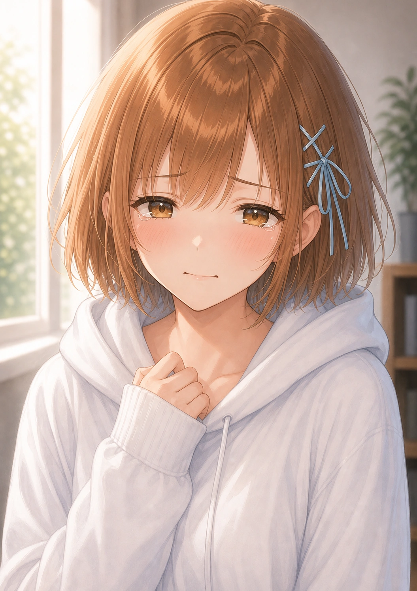
<figcaption>泣きそうなのを、ぎりぎりのところでこらえる。</figcaption>
</figure>

<code>source/generated/tonari-no-hyoujou/20260706_extra-07_holding-back-tears_v2.webp</code>

</section>

<section class="expression-page" id="26-extra-sleep-crash">

E08 / 追加 8 表情

<h3>完全寝落ち寸前</h3>

extra-sleep-crash

<figure>
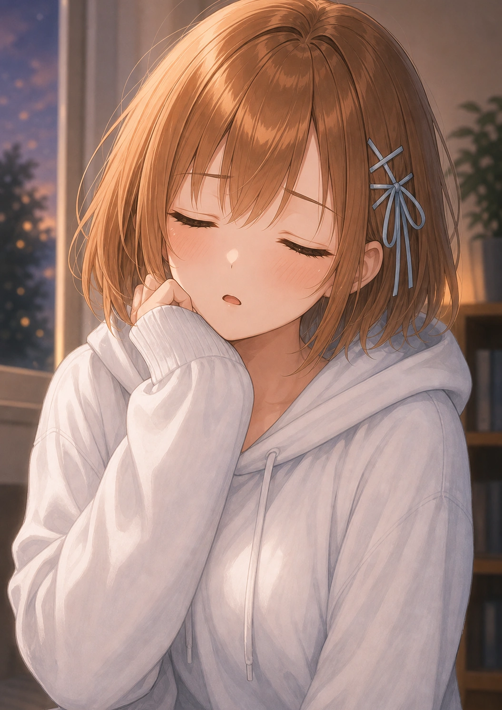
<figcaption>もう返事もほどける、寝落ち寸前の顔。</figcaption>
</figure>

<code>source/generated/tonari-no-hyoujou/20260706_extra-08_sleep-crash_v3.webp</code>

</section>

## 巻末メモ

<figure>
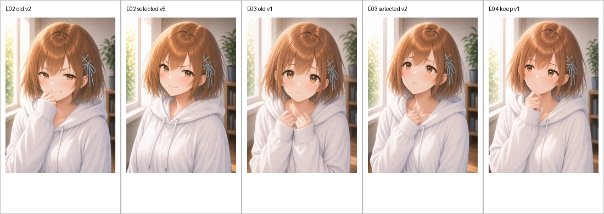
<figcaption>追加表情 E02-E04 品質レビュー</figcaption>
</figure>

<figure>
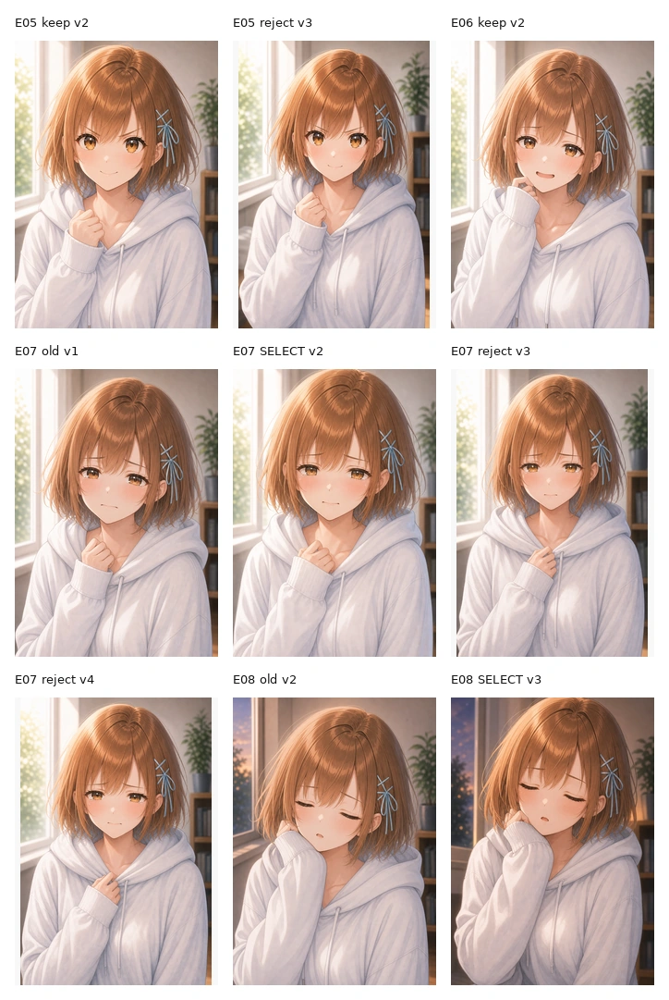
<figcaption>追加表情 E05-E08 品質レビュー</figcaption>
</figure>

このMarkdownは軽量な製本用です。ブラウザやMarkdownビューアで開き、必要なら印刷ダイアログからPDF化できます。
